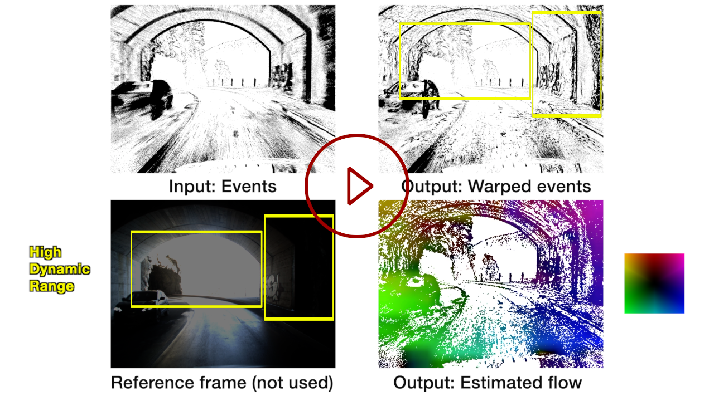

# Secrets of Event-Based Optical Flow (ECCV 2022)


[](https://youtu.be/nUb2ZRPdbWk)

This is the repository for [**Secrets of Event-Based Optical Flow**](https://arxiv.org/abs/2207.10022), **ECCV 2022 Oral** by  
[Shintaro Shiba](http://shibashintaro.com/), [Yoshimitsu Aoki](https://aoki-medialab.jp/aokiyoshimitsu-en/) and [Guillermo Callego](https://sites.google.com/view/guillermogallego).

 <!-- - [Paper]() -->
 - [Video](https://youtu.be/nUb2ZRPdbWk)
 - [PDF](https://arxiv.org/pdf/2207.10022)
 
 We plan to release the **code** by the time of presentation.  
If you use this work in your research, please cite it as follows:

```bibtex
@InProceedings{Shiba22eccv,
  author        = {Shintaro Shiba and Yoshimitsu Aoki and Guillermo Gallego},
  title         = {Secrets of Event-based Optical Flow},
  booktitle     = "European Conference on Computer Vision (ECCV)",
  year          = 2022
}
```

# Setup

TBD.


# Copyright

Shintaro Shiba [@shiba24](https://github.com/shiba24)

## LICENSE

TBD.


Additional Resources on Event-based Vision
-------
* [Event Collapse in Contrast Maximization Frameworks](https://arxiv.org/pdf/2207.04007)
* [Research page (TU Berlin RIP lab)](https://sites.google.com/view/guillermogallego/research/event-based-vision)
* [Course at TU Berlin](https://sites.google.com/view/guillermogallego/teaching/event-based-robot-vision)
* [Survey paper](http://rpg.ifi.uzh.ch/docs/EventVisionSurvey.pdf)
* [List of Resources](https://github.com/uzh-rpg/event-based_vision_resources)
